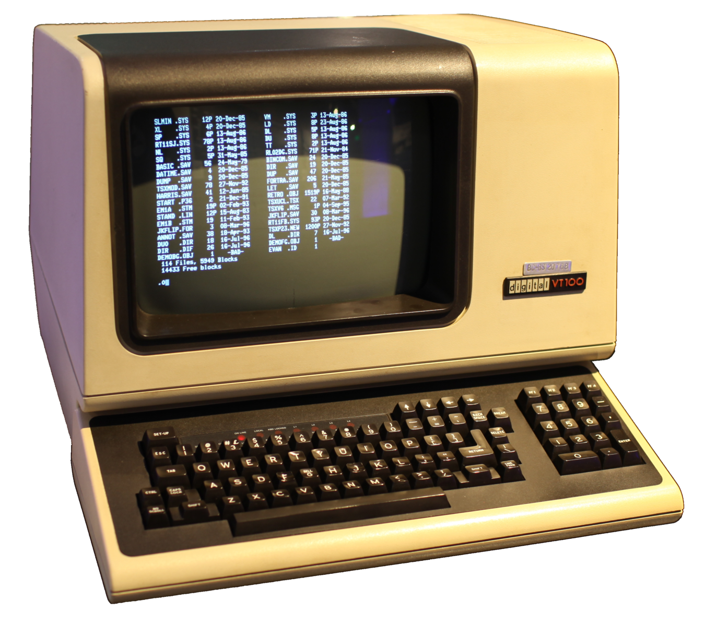
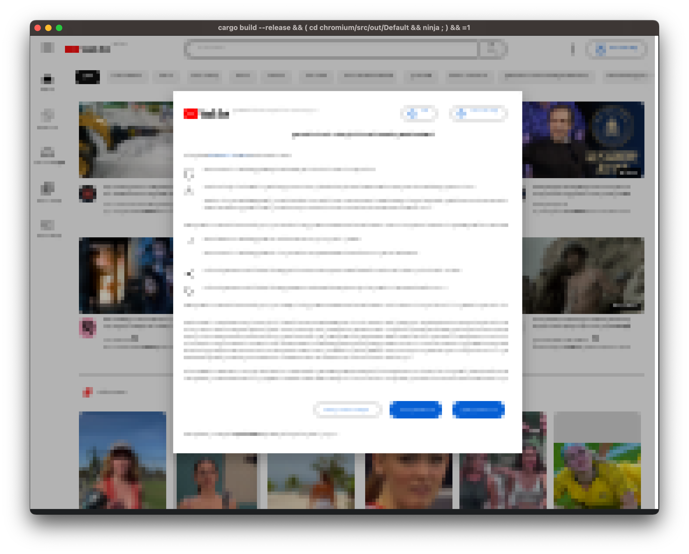
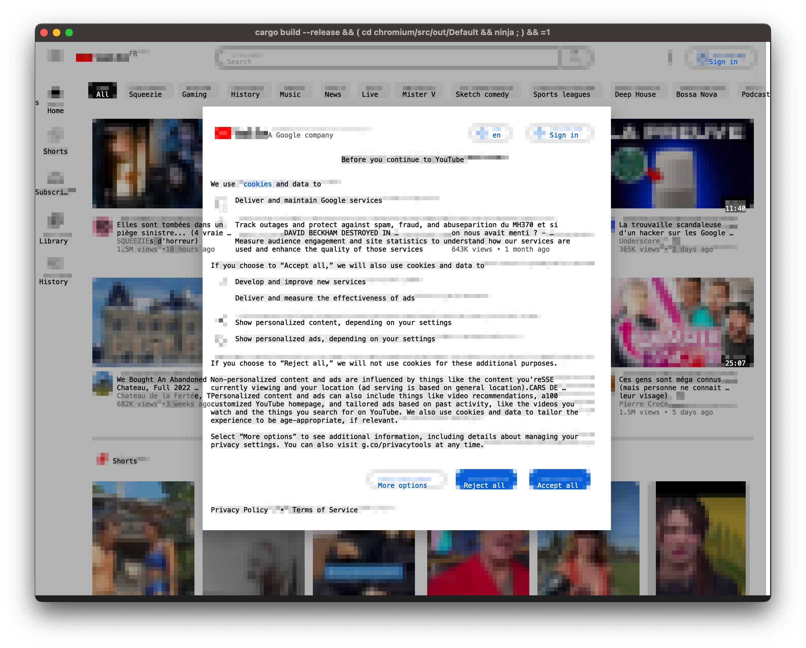
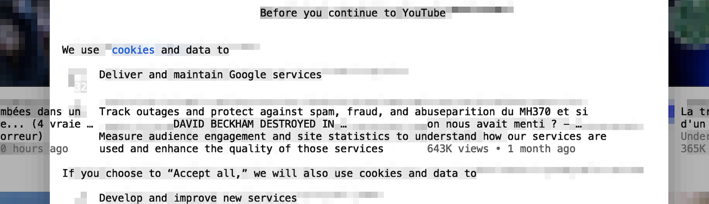
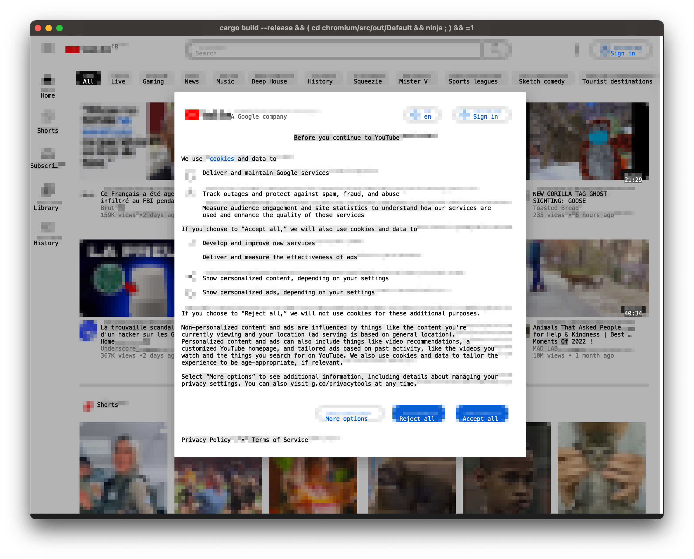
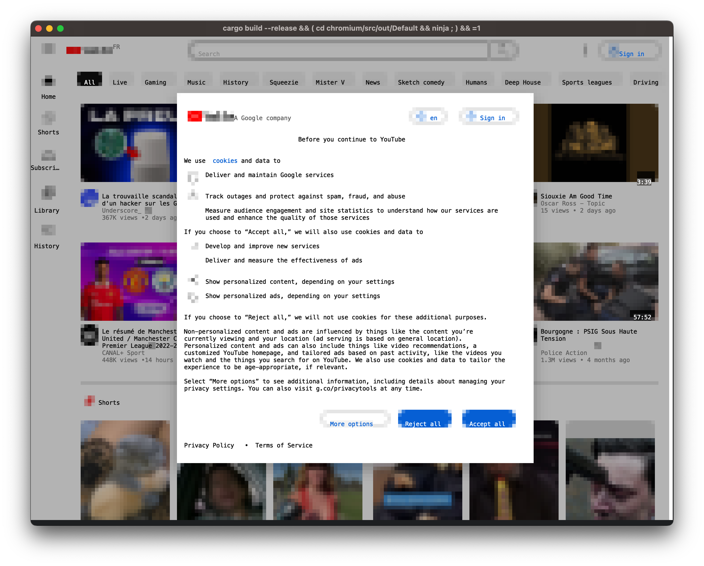
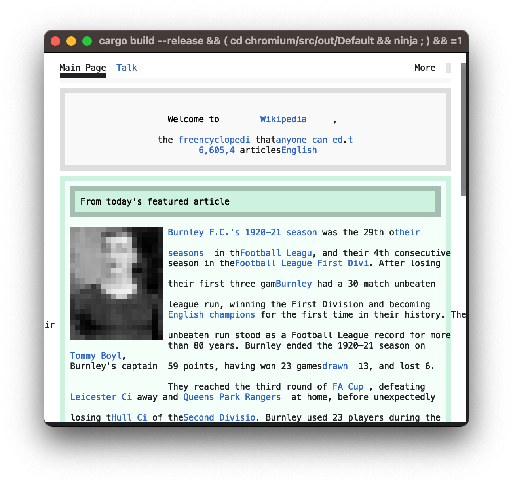
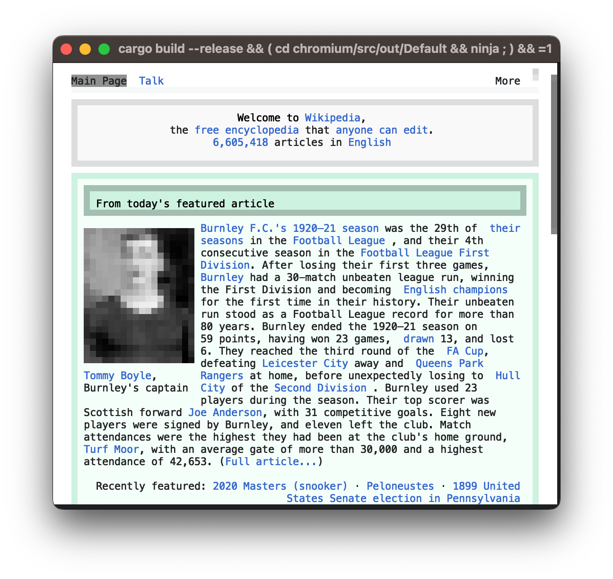
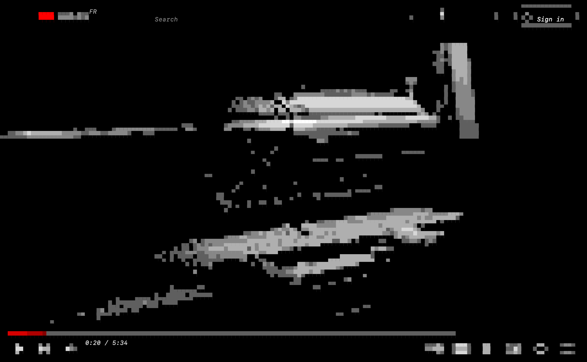
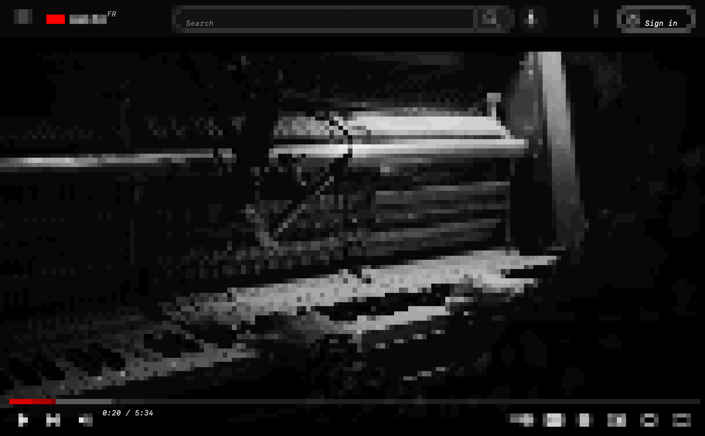

# Forking Chrome to render in a terminal

> January 27, 2023

import { Box } from '@mui/material'
import { ResponsiveSplitter } from '../../components/responsive-splitter'
import { SequenceAnimation } from '../../components/sequence-animation'
import Hahaha from './hahaha.mp4'
import Oooh from './oooh.mp4'
import Title from './title.mp4'
import YoThatsATest from './yo-thats-a-test.mp4'

I wrote about [forking Chrome to turn HTML to SVG](../html2svg/index.mdx) two months ago, today we're going to do something similar by making it render into a terminal.

Let me introduce you to [the Carbonyl web browser](https://github.com/fathyb/carbonyl)!

## Drawing

<ResponsiveSplitter>
    <Box>
        There isn't much you can draw in a terminal, you're guaranteed to be able to render monospace characters in a fixed grid, and that's it. Escape sequences exist to perform actions like moving the cursor, changing the text color, or mouse tracking. Some came from the days of physical terminals like the DEC VT100, others came from the xterm project.

        Assuming a popular terminal emulator, we can:

        -   Move the cursor
        -   Write Unicode characters
        -   Set a character's background and foreground color
        -   Use a 6x6x6 RGB palette, or 24 bits RGB if `COLORTERM` is set the `truecolor`

        One of the unicode characters we can render is the lower half block element `U+2584`: `▄`. Knowing that cells generally have an aspect ratio of 1:2, we can render perfectly square pixels by setting the background color to the top pixel color, and the foregound color to the bottom pixel color.

    </Box>
    <figure>
        
        <figcaption>
            A DEC VT100 terminal ([source](https://commons.wikimedia.org/wiki/File:DEC_VT100_terminal_transparent.png))
        </figcaption>
    </figure>

</ResponsiveSplitter>

---

Let's hook `html2svg`'s output into a Rust program:

<ResponsiveSplitter>
    ```rust
    fn move_cursor((x, y): (usize, usize)) {
        println!("\x1b[{};{}H", y + 1, x + 1)
    }

    fn set_foreground((r, g, b): (u8, u8, u8)) {
        println!("\x1b[38;2;{};{};{}m", r, g, b)
    }

    fn set_background((r, g, b): (u8, u8, u8)) {
        println!("\x1b[48;2;{};{};{}m", r, g, b)
    }

    fn print_pixels_pair(
        top: (u8, u8, u8),
        bottom: (u8, u8, u8),
        cursor: (usize, usize)
    ) {
        move_cursor(cursor);
        set_background(top);
        set_foreground(bottom);
        println!("▄");
    }
    ```
    

</ResponsiveSplitter>

---

Not bad. To render text, we need to create a new Skia device using C++, lets call it `TextCaptureDevice`. We'll make it call a `draw_text` function written in Rust. Just like in `html2svg`, we need to convert glyph IDs into unicode characters.

<ResponsiveSplitter>
    ```cpp
    class TextCaptureDevice: public SkClipStackDevice {
      void onDrawGlyphRunList(SkCanvas*,
                              const sktext::GlyphRunList& glyphRunList,
                              const SkPaint&,
                              const SkPaint& paint) override {
        // Get the text position
        auto position = localToDevice().mapRect(glyphRunList.origin());

        for (auto& glyphRun : glyphRunList) {
          auto runSize = glyphRun.runSize();
          SkAutoSTArray<64, SkUnichar> unichars(runSize);

          // Convert glyph IDs to Unicode characters
          SkFontPriv::GlyphsToUnichars(glyphRun.font(),
                                      glyphRun.glyphsIDs().data(),
                                      runSize,
                                      unichars.get());

          // Draw that text on the terminal
          draw_text(unichars.data(), runSize, position, paint.getColor());
        }
      }
    }
    ```
    

</ResponsiveSplitter>

---

Better! But the text is scrambled at the center. Our `TextCaptureDevice` does not account for occlusion, drawing a rectangle does not clear the text behind it.



Let's add some code to the `drawRect` and `drawRRect` methods to clear the text if we're filling with a solid color:

<ResponsiveSplitter>
    ```cpp
    void drawRRect(const SkRRect& rect, const SkPaint& paint) override {
        drawRect(rect.rect(), paint);
    }

    void drawRect(const SkRect& rect, const SkPaint& paint) override {
        if (
            paint.getStyle() == SkPaint::Style::kFill_Style &&
            paint.getAlphaf() == 1.0
        ) {
            clear_text(localToDevice().mapRect(rect));
        }
    }
    ```
    

</ResponsiveSplitter>

---

The gray background behind text elements is caused by the software rasterizer rendering text in our bitmap. Let's remove it:

<ResponsiveSplitter>
    ```diff chromium/third_party/skia/src/core/SkBitmapDevice.cpp#521-527@7a9783136c9dc4ff2b188aac722e75eabb7bf287
    void SkBitmapDevice::onDrawGlyphRunList(SkCanvas* canvas,
                                            const sktext::GlyphRunList& glyphRunList,
                                            const SkPaint& initialPaint,
                                            const SkPaint& drawingPaint) {
    -    SkASSERT(!glyphRunList.hasRSXForm());
    -    LOOP_TILER( drawGlyphRunList(canvas, &fGlyphPainter, glyphRunList, drawingPaint), nullptr )
    }
    ```
    
</ResponsiveSplitter>

---

That was the easy part, let's handle inputs!

## Input

<ResponsiveSplitter>
    <>
        Some sequences exist to get a terminal emulator to track and report mouse events. For example, if you print `\x1b[?1003h`, the terminal should start sending events using this format:
    </>
    <>
        ```rust
        fn report_mouse_move((x, y): (usize, usize)) {
            write!(get_stdin(), "\x1b[<35;{};{}M", y + 1, x + 1)
        }
        fn report_mouse_down((x, y): (usize, usize)) {
            write!(get_stdin(), "\x1b[<0;{};{}M", y + 1, x + 1)
        }
        fn report_mouse_up((x, y): (usize, usize)) {
            write!(get_stdin(), "\x1b[<0;{};{}m", y + 1, x + 1)
        }
        ```
    </>
</ResponsiveSplitter>

These are similar to the sequences we use for styling our output. The `\x1b[` prefix is called the Control Sequence Introducer.

<ResponsiveSplitter>
    <>
        We need to notify the browser to wrap this up, but there is a catch: we
        need to block a thread to read stdin, but the browser methods should be
        called from the main thread. Thankfully, messages passing is available
        almost everywhere through the
        [`TaskRunner`](https://source.chromium.org/chromium/chromium/src/+/main:base/task/task_runner.h;drc=63e1f9974bc57b0ca12d790b2a73e5ba7f5cec6e;l=60)
        class.
    </>
    ```cpp
    carbonyl::browser->BrowserMainThread()->PostTask(
        FROM_HERE,
        base::BindOnce(
            &HeadlessBrowserImpl::OnMouseDownInput,
            x,
            y
        )
    );
    ```

</ResponsiveSplitter>

<ResponsiveSplitter>
    ```rust carbonyl/src/input/parser.rs#69-96@5d0807e35b893963953791a1878fbe08de81a3ce
    for &key in input {
        sequence = match sequence {
            Sequence::Char => match key {
                0x1b => Sequence::Escape,
                0x03 => emit!(Event::Exit),
                key => emit!(Event::KeyPress { key }),
            },
            Sequence::Escape => match key {
                b'[' => Sequence::Control,
                b'P' => Sequence::DeviceControl(DeviceControl::new()),
                0x1b =>
                    emit!(Event::KeyPress { key: 0x1b }; continue),
                key => {
                    emit!(Event::KeyPress { key: 0x1b });
                    emit!(Event::KeyPress { key })
                }
            },
            Sequence::Control => match key {
                b'<' => Sequence::Mouse(Mouse::new()),
                b'A' => emit!(Event::KeyPress { key: 0x26 }),
                b'B' => emit!(Event::KeyPress { key: 0x28 }),
                b'C' => emit!(Event::KeyPress { key: 0x27 }),
                b'D' => emit!(Event::KeyPress { key: 0x25 }),
                _ => Sequence::Char,
            },
            Sequence::Mouse(ref mut mouse) => parse!(mouse, key),
            Sequence::DeviceControl(ref mut dcs) => parse!(dcs, key),
        }
    }
    ```
    <figure>
        <video src={YoThatsATest} autoPlay loop controls />
        <figcaption>Google recommending me Chrome, lol</figcaption>
    </figure>
</ResponsiveSplitter>

## Pipe

We have something that sorts of work, at the cost of a steady 400% CPU usage, and that's not counting iTerm2 which uses ~200%. We've got a few problems:

-   We need to much resources to render at 5 FPS
-   We render every time, even when nothing changes
-   We print all characters even if they didn't change on an individual level

Modern browsers employ a multi-process architecture to improve security. It separates websites into different processes, reducing the potential damage caused by vulnerabilities. The renderer process is running in an OS-level sandboxed environment that blocks certain system calls, such as file-system access. The GPU process, is also considered unprivileged and cannot reach renderer process in order to protect against vulnerabilities in GPU APIs such as WebGL. In contrast, the browser process, considered privileged, can communicate freely with any process.


<ResponsiveSplitter>
    <Box>
        [`CapturePaintPreview`](https://source.chromium.org/chromium/chromium/src/+/main:third_party/blink/public/web/web_local_frame.h;drc=e95ee489e7a4aee5408d8bb0e13bebc61adcca0d;l=786) is great for `html2svg`, but it's not designed for real-time rendering. It's using IPC calls to correctly support out-of-process iframes, making roundtrips between the browser, GPU, and renderer processes. It downloads hardware accelerated images from the GPU, explaining the surprising memory bandwidth usage. We can disable the fetching, and even disable hardware acceleration, but we still have an expensive IPC machinery holding us back.

        Software rendering is still very common, it even used to be the default if you can believe it. It was fairly easy back in the single-process days, but nowadays shared memory regions are configured to efficiently render using multiple processes. If we can get our pixels into one of these memory regions, we would just have to notify our browser process using a simple IPC message.
    </Box>
    <figure>
        <SequenceAnimation>
            
            
            
            
            
        </SequenceAnimation>
        <figcaption>doing this 60 times a second isn't very efficient</figcaption>
    </figure>

</ResponsiveSplitter>

<ResponsiveSplitter align='left'>
    <Box>

        In order to setup this shared memory, we need to implement an [`HostDisplayClient`](https://source.chromium.org/chromium/chromium/src/+/main:components/viz/host/host_display_client.h;drc=c8b537923f4fdbdf492a1e475b0f2bff0340a32b;l=25) and a [`SoftwareOutputDevice`](https://source.chromium.org/chromium/chromium/src/+/main:components/viz/service/display/software_output_device.h;drc=12be03159fe22cd4ef291e9561762531c2589539;l=33) to manage a custom [`LayeredWindowUpdater`](https://source.chromium.org/chromium/chromium/src/+/main:services/viz/privileged/mojom/compositing/layered_window_updater.mojom;drc=098756533733ea50b2dcb1c40d9a9e18d49febbe;l=13) which implements [`OnAllocatedSharedMemory()`](https://source.chromium.org/chromium/chromium/src/+/main:services/viz/privileged/mojom/compositing/layered_window_updater.mojom;drc=098756533733ea50b2dcb1c40d9a9e18d49febbe;l=21).

        [`HostDisplayClient`](https://source.chromium.org/chromium/chromium/src/+/main:components/viz/host/host_display_client.h;drc=c8b537923f4fdbdf492a1e475b0f2bff0340a32b;l=25) runs in the browser process and is called by the GPU process through IPC. To wrap this up we need to make the GPU process use our custom display client by adding the following to [`VizProcessTransportFactory::OnEstablishedGpuChannel()`](https://source.chromium.org/chromium/chromium/src/+/main:content/browser/compositor/viz_process_transport_factory.cc;l=351;drc=c8b537923f4fdbdf492a1e475b0f2bff0340a32b?q=VizProcessTransportFactory::OnEstablishedGpuChannel&sq=&ss=chromium%2Fchromium%2Fsrc):

        ```diff chromium/content/browser/compositor/viz_process_transport_factory.cc#402-403@c8b537923f4fdbdf492a1e475b0f2bff0340a32b
        compositor_data.display_client =
        -      std::make_unique<HostDisplayClient>(compositor);
        +      std::make_unique<carbonyl::HostDisplayClient>();
        ```
    </Box>
    <Box>
        ```cpp carbonyl/src/browser/host_display_client.cc#28-44@5d0807e35b893963953791a1878fbe08de81a3ce
        void LayeredWindowUpdater::OnAllocatedSharedMemory(
            const gfx::Size& pixel_size,
            base::UnsafeSharedMemoryRegion region
        ) {
            if (region.IsValid())
                shm_mapping_ = region.Map();
        }

        void LayeredWindowUpdater::Draw(
            const gfx::Rect& damage_rect,
            DrawCallback draw_callback
        ) {
            carbonyl_draw_bitmap(
                shm_mapping_.GetMemoryAs<uint8_t>(),
                shm_mapping_.size()
            );

            std::move(draw_callback).Run();
        }
        ```
    </Box>

</ResponsiveSplitter>

---

We solved the bitmap problem, now how can we extract text data? This data lives in the renderer process, but our windowing code lives in the browser process. We need to make the renderer interact with the browser process.

## Mojo

<ResponsiveSplitter>
    <Box>
        Mojo is a library for inter-process communication. It defines an IDL for serializing data which supports native handles (ie. file descriptors, shared memory region, callbacks), and can be used to generate C++, Java (Android), and JavaScript (DevTools) bindings. It's extensively documented, and fairly simple to use.

        We'll start by making an interface `CarbonylRenderService` that runs on the browser process, with a method `DrawText` called from the renderer process.
    </Box>
    ```d carbonyl/src/browser/carbonyl.mojom#1@5d0807e35b893963953791a1878fbe08de81a3ce
    // Our C++ bindings will be in the carbonyl::mojom namespace
    module carbonyl.mojom;

    // Import existing bindings to common structures
    import "ui/gfx/geometry/mojom/geometry.mojom";
    import "skia/public/mojom/skcolor.mojom";

    // Define a structure to hold text to render
    struct TextData {
        // An UTF-8 string with the contents
        string contents;
        // Bounds, size only defined for clearing
        gfx.mojom.RectF bounds;
        // Color of the text
        skia.mojom.SkColor color;
    };

    // The browser process runs this service
    interface CarbonylRenderService {
        // The renderer process calls this method
        DrawText(array<TextData> data);
    };
    ```

</ResponsiveSplitter>

This `.mojom` code generates C++ temporary files which we can then include to write the implementation code.

Mojo receivers such as our service are part of the native handles we can send between processes, to register the implementation we just need to add it to the `BrowserInterfaceBroker`, which will get called by the renderer through `BrowserInterfaceBrokerProxy`:

```cpp chromium/content/browser/browser_interface_binders.cc#890@c8b537923f4fdbdf492a1e475b0f2bff0340a32b
map->Add<carbonyl::mojom::CarbonylRenderService>(
    base::BindRepeating(&RenderFrameHostImpl::GetCarbonylRenderService,
                        base::Unretained(host)));
```

```cpp chromium/content/renderer/render_frame_impl.cc#2206@c8b537923f4fdbdf492a1e475b0f2bff0340a32b
GetBrowserInterfaceBroker().GetInterface(
  std::move(carbonyl_render_service_receiver_)
);
```

Now, we need to get our text data without any expensive round-trip. Blink has a `GetPaintRecord()` method to get the latest paint data for a page, but it's not behind a public API, which we need because our code runs in the content renderer. Ideally we should hook into the compositor (`cc`), but it's way more involved. It's dirty but we can workaround this by casting to the private `blink::WebViewImpl`:

```cpp
auto* view = static_cast<blink::WebViewImpl*>(GetWebFrame()->View());

view->MainFrameImpl()->GetFrame()->View()->GetPaintRecord().Playback(&canvas);
carbonyl_render_service_->DrawText(std::move(data));
```

Surprise after the first run: the text content doesn't follow the bitmap. Aaah, scrolling and animating is done on the compositor thread, which frees the main thread and makes everything smoother. Let's procastinate doing things right by adding `--disable-threaded-scrolling` `--disable-threaded-animation` to the command line arguments.

<Box display='flex' flexDirection='row' flexWrap='wrap'>
    <Box component='figure' flex={1} minWidth={250}>
        <video src={Hahaha} autoPlay loop controls />
        <figcaption>Threaded compositing enabled</figcaption>
    </Box>
    <Box component='figure' flex={1} minWidth={250}>
        <video src={Oooh} autoPlay loop controls />
        <figcaption>Threaded compositing disabled</figcaption>
    </Box>

</Box>

Pretty smooth, it'll be even smoother when threaded compositing is fixed! And we've fixed our biggest problem: we don't use any CPU when idling, and scrolling consumes ~15%.

## Layout

<ResponsiveSplitter>
    <Box>
        Thing is, we can only render one font-size, but Blink doesn't know that. This causes the layout to be messed up, with text chunks overlapping or overly spaced. This is especially visible on websites with a lot of textual content and links like Wikipedia.

        Another dirty - yet effective - hack we can use is forcing a monospaced font on every element. We can do that by adding some code to [`StyleResolver::ResolveStyle`](https://source.chromium.org/chromium/chromium/src/+/main:third_party/blink/renderer/core/css/resolver/style_resolver.cc;l=954;drc=a67b5c344bfa8645cb2f66685e010b425ac19ea1).
    </Box>
    <Box>
        ```cpp chromium/third_party/blink/renderer/core/css/resolver/style_resolver.cc#954@a67b5c344bfa8645cb2f66685e010b425ac19ea1
        auto font = state.StyleBuilder().GetFontDescription();

        font.SetStretch(ExtraExpandedWidthValue());
        font.SetKerning(FontDescription::kNoneKerning);
        font.SetComputedSize(11.75 / 7.0);
        font.SetGenericFamily(FontDescription::kMonospaceFamily);
        font.SetIsAbsoluteSize(true);
        state.StyleBuilder().SetFontDescription(font);
        state.StyleBuilder().SetLineHeight(Length::Fixed(14.0 / 7.0));
        ```
    </Box>

</ResponsiveSplitter>

---

<Box display="flex" flexDirection="row" flexWrap="wrap">
    <Box flex={1} minWidth={250}>
        <figure>
            
            <figcaption>Default layout</figcaption>
        </figure>
    </Box>
    <Box flex={1} minWidth={250}>
        <figure>
            
            <figcaption>Fixed layout</figcaption>
        </figure>
    </Box>
</Box>

## LoDPI

<ResponsiveSplitter>
    <>
        One expensive step in our rendering pipeline is downscaling: we need to resize the framebuffer from its virtual space to its physical space. What we're doing is kind of the opposite of HiDPI rendering, whose most common ratio is 2x which means 1 pixel on the web equals 2 pixels on the screen. Our ratio is `1 / 7` which means 7 pixels on the web renders to 1 block on our terminal.

        The annoying thing about HiDPI is that it can make rendering ~2x slower, whereas Carbonyl LoDPI&reg; makes rendering run ~7x faster. We just need to force our scaling into the [`Display`](https://source.chromium.org/chromium/chromium/src/+/main:ui/display/display.h;drc=8d3b4cc374e70dcfef858a355ac13e75d08c4f67;l=31) class.
    </>
    ```cpp chromium/ui/display/display.cc#77-89@63e1f9974bc57b0ca12d790b2a73e5ba7f5cec6e
    // static
    float Display::GetForcedDeviceScaleFactor() {
        return 1.0 / 7.0;
    }

    // static
    bool Display::HasForceDeviceScaleFactor() {
        return true;
    }
    ```

</ResponsiveSplitter>

## Color

I looked for examples of RGB color conversion to `xterm-256` but the code I found was either wrong or slow because it did a nearest neighbor search. We're going to do it for every pixel so it should run fast.

The formula for the conversion is fairly simple, assuming color values between 0 and 1: `16 + r * 5 * 36 + g * 5 * 6 + b * 5`.

<ResponsiveSplitter align="left">
    <>
        The twist that most code online gets wrong is that the 6 color levels are not linear: 0, 95, 135, 175, 215, 255; there is a 95 gap between the first and second values, and 40 for the rest.

        It makes sense to limit the dark range, color differences are more visible with bright colors. For us, it means that we can convert a value between 0 and 255 using `max(0, color - 95 - 40) / 40`.
    </>
    ```rust
    pub fn to_xterm(&self) -> u8 {
        let r = (self.r as f32 - (95.0 - 40.0)).max(0.0) / 40.0;
        let g = (self.g as f32 - (95.0 - 40.0)).max(0.0) / 40.0;
        let b = (self.b as f32 - (95.0 - 40.0)).max(0.0) / 40.0;

        (16.0 +
            r.round() * 36.0 +
            g.round() * 6.0 +
            b.round()) as u8
    }
    ```

</ResponsiveSplitter>

---

---

<ResponsiveSplitter>
    <>
        The conversion itself can be thought of as a dot product of `(r, g, b)` and `(36, 6, 1)`. We can move the substraction to an `mul_add` call to help the compiler use a fused multiply-add instruction.

        The last step is grayscale: our xterm profile offers 256 colors, there are the 216 colors from the RGB cube (`6 * 6 * 6`), the 16 configurable system colors, and 24 gray levels which go from `rgb(8,8,8)` to `rgb(238,238,238)`.

        To find out if a color is on a grayscale, we can substract its minimal value to its maximum value and check if it's under a threshold, let's say 8.
    </>
    ```rust carbonyl/src/output/xterm.rs#4-24@5d0807e35b893963953791a1878fbe08de81a3ce
    pub fn to_xterm(&self) -> u8 {
        if self.max_val() - self.min_val() < 8 {
            match self.r {
                0..=4 => 16,
                5..=8 => 232,
                238..=246 => 255,
                247..=255 => 231,
                r => 232 + (r - 8) / 10,
            }
        } else {
            let scale = 5.0 / 200.0;

            (16.0
                + self
                    .cast::<f32>()
                    .mul_add(scale, scale * -55.0)
                    .max(0.0)
                    .round()
                    .dot((36.0, 6.0, 1.0))) as u8
        }
    }
    ```

</ResponsiveSplitter>

<Box display="flex" flexDirection="row" flexWrap="wrap">
    <Box flex={1} minWidth={250}>
        <figure>
            
            <figcaption>Simple RGB cube</figcaption>
        </figure>
    </Box>
    <Box flex={1} minWidth={250}>
        <figure>
            
            <figcaption>With grayscale code path</figcaption>
        </figure>
    </Box>
</Box>

We still have one tiny problem: how can you detect if a terminal supports true-color
or 256 colors? A quick Google search leads us to the `COLORTERM` environment variable,
which is `24bit` or `truecolor` if true-color is supported. But that won't work in
Docker or SSH, which are our primary targets.

<ResponsiveSplitter>

    <>
        A trick we can use is a DCS (Device Control Sequence) to fetch a setting value, like the current background color. If we set an RGB value and get an RGB value back, we can enable true-color.

        You can try it by running the following on your terminal:
        ```console
        $ printf "\e[48;2;13;37;42m\eP\$qm\e\\"; cat
        ```

        - `\e`: start escape sequence
            - `[`: introduce control sequence
            - `48`: set foreground
            - `2`: using an RGB color
            - `13`: R is 13
            - `37`: G is 37
            - `42`: B is 42
            - `m`: select graphic rendition
        - `\e`: start escape sequence
            - `P`: introduce device control sequence
            - `$`: enter status mode
            - `q`: query current setting
            - `m`: select graphic rendition

        If the commands are supported, you should get the following output with a dark turquoise background:

        <p>
            <Box component='code' sx={{ backgroundColor: 'rgb(13,37,42)' }}> ^[P1$r0;48:2:1:13:37:42m^[\ </Box>
        </p>

        This is what the terminal emulator sends to stdin, and what we can parse to toggle true-color on.
    </>
    <>
        ```rust no-margin carbonyl/src/input/dcs/parser.rs#27-41@5d0807e35b893963953791a1878fbe08de81a3ce
        self.sequence = match self.sequence {
        ```
        <pre className='no-margin'>
            <code style={{ color: '#7c7c7c' }}>
                <span>    // </span><span style={{ opacity: .4 }}>^[P</span><span>1</span><span style={{ opacity: .4 }}>$r0;48:2:1:13:37:42m^[&bsol;</span>
            </code>
        </pre>
        ```rust no-margin
            Code => match key {
                b'0' | b'1' => Type(key),
                _ => control_flow!(break)?,
            },
        ```
        <pre className='no-margin'>
            <code style={{ color: '#7c7c7c' }}>
                <span>    // </span><span style={{ opacity: .4 }}>^[P1</span><span>$</span><span style={{ opacity: .4 }}>r0;48:2:1:13:37:42m^[&bsol;</span>
            </code>
        </pre>
        ```rust no-margin
            Type(code) => match key {
                b'$' => Status(StatusParser::new(code)),
                b'+' => Resource(ResourceParser::new(code)),
                _ => control_flow!(break)?,
            },
        ```
        <pre className='no-margin'>
            <code style={{ color: '#7c7c7c' }}>
                <span>    // </span><span style={{ opacity: .4 }}>^[P1$</span><span>r0;48:2:1:13:37:42m^[&bsol;</span>
            </code>
        </pre>
        ```rust no-margin
            Status(ref mut status) => return status.parse(key),
            Resource(ref mut resource) => return resource.parse(key),
        };
        ```

        ```rust no-margin carbonyl/src/input/dcs/status.rs#33-79@5d0807e35b893963953791a1878fbe08de81a3ce
        self.sequence = match self.sequence {
        ```
        <pre className='no-margin'>
            <code style={{ color: '#7c7c7c' }}>
                <span>    // </span><span style={{ opacity: .4 }}>^[P1$</span><span>r</span><span style={{ opacity: .4 }}>0;48:2:1:13:37:42m^[&bsol;</span>
            </code>
        </pre>
        ```rust no-margin
            Start => match key {
                b'r' => Value,
                _ => control_flow!(break)?,
            },
        ```
        <pre className='no-margin'>
            <code style={{ color: '#7c7c7c' }}>
                <span>    // </span><span style={{ opacity: .4 }}>^[P1$r</span><span>0;48:2:1:13:37:42m^[</span><span style={{ opacity: .4 }}>&bsol;</span>
            </code>
        </pre>
        ```rust no-margin
            Value => match key {
        ```
        <pre className='no-margin'>
            <code style={{ color: '#7c7c7c' }}>
                <span>        // </span><span style={{ opacity: .4 }}>^[P1$r0;48:2:1:13:37:42m</span><span>^[</span><span style={{ opacity: .4 }}>&bsol;</span>
            </code>
        </pre>
        ```rust no-margin
                0x1b => self.terminate(),
        ```
        <pre className='no-margin'>
            <code style={{ color: '#7c7c7c' }}>
                <span>        // </span><span style={{ opacity: .4 }}>^[P1$r0</span><span>;</span><span style={{ opacity: .4 }}>48:2:1:13:37:42m^[&bsol;</span>
            </code>
        </pre>
        ```rust no-margin
                b';' => self.push_value(),
        ```
        <pre className='no-margin'>
            <code style={{ color: '#7c7c7c' }}>
                <span>        // </span><span style={{ opacity: .4 }}>^[P1$r</span><span>0</span><span style={{ opacity: .4 }}>;</span><span>48:2:1:13:37:42m</span><span style={{ opacity: .4 }}>^[&bsol;</span>
            </code>
        </pre>
        ```rust no-margin
                char => self.push_char(char),
            },
        ```
        <pre className='no-margin'>
            <code style={{ color: '#7c7c7c' }}>
                <span>    // </span><span style={{ opacity: .4 }}>^[P1$r0;48:2:1:13:37:42m^[</span><span>&bsol;</span>
            </code>
        </pre>
        ```rust no-margin
            Terminator => control_flow!(break self.parse_event(key))?,
        };
        ```
    </>

</ResponsiveSplitter>

## Title

<ResponsiveSplitter align="left">
    <>
        A few xterm sequences allow setting the terminal window title, we could use that to display the current page title.

        ```rust
        fn set_title(title: &str) {
            // Set icon name and window title to string
            println!("\x1b]0;{}\x07", title);
            // Set icon name to string
            println!("\x1b]1;{}\x07", title);
            // Set window title to string
            println!("\x1b]2;{}\x07", title);
        }
        ```

        To get notified when the title changes, we can simply implement [`WebContentsObserver::TitleWasSet()`](https://source.chromium.org/chromium/chromium/src/+/main:content/public/browser/web_contents_observer.h;drc=d868f781dd811d46a0a5ae88ccaf4b5afb0f0f3c;l=576):

        ```cpp
        void HeadlessWebContentsImpl::TitleWasSet(content::NavigationEntry* entry) {
            carbonyl::Renderer::Main()->SetTitle(
                base::UTF16ToUTF8(entry->GetTitleForDisplay())
            );
        }
        ```
    </>
    <figure>
        <video src={Title} autoPlay loop controls />
        <figcaption>nice</figcaption>
    </figure>

</ResponsiveSplitter>

## Final thoughts

That's all for today folks, [check out Carbonyl on GitHub](https://github.com/fathyb/carbonyl)!

This was my first Rust project and I finally get the hype now. What a cool language!

### Stay tuned

The post for next month [will be a visual introduction to Fourier Analysis](/every-sin). After that, we'll look into a speculative JS VM in Rust.

Use [the RSS feed](/rss.xml) to stay tuned, you can also watch [the website repo](https://github.com/fathyb/fathy.fr) for releases on GitHub.

### Discuss
