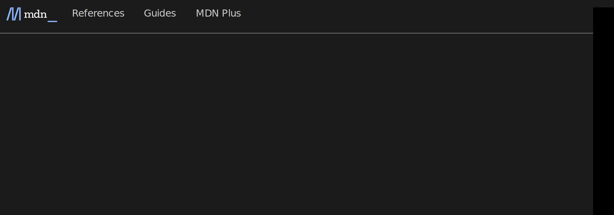

# Forking Chrome to turn HTML into SVG

> November 11th 2022

I've been working on a program called [`html2svg`](https://github.com/fathyb/html2svg), it converts web pages to SVG. It's based on a fork of Chromium to support modern web standards.

I'll explain most patches in this post. We'll look into Chrome, v8, Skia, HarfBuzz, the TTF file format, and we'll even push improvements and fixes to Skia.

## Take a picture


Chromium is built on top of Blink: an HTML engine forked from WebKit, and Skia: a 2D engine also used in Firefox and Android.

Blink consumes the HTML input, and Skia produces the graphical output. The Chromium compositor (`cc`) is in between, but we'll ignore it for now.

In order to support multiple platforms and targets, Skia is built to render into a back-end: it could be its GPU renderer called Ganesh, its software rasterizer, or even a PDF file. This is how Chromium can work with or without a GPU and export web pages to PDF files with high fidelity.

Recently, an experimental SVG back-end has been added to Skia. We're going to use this to build `html2svg`.

To get started, we'll need to find a way to render the page into an SVG canvas and expose it under a JS API.

The [Chromium docs explains how you can export an `.skp` file](https://www.chromium.org/developers/how-tos/trace-event-profiling-tool/saving-skp-s-from-chromium/) using the `--enable-gpu-benchmarking` flag.

An `.skp` file is a binary representation of an [`SkPicture`](https://source.chromium.org/chromium/chromium/src/+/main:third_party/skia/include/core/SkPicture.h;drc=8928b024556f913015a48edab03384311c3c45d8;l=39), a C++ class containing Skia drawing instructions that can be replayed into any canvas through its [`playback()`](https://source.chromium.org/chromium/chromium/src/+/main:third_party/skia/include/core/SkPicture.h;drc=8928b024556f913015a48edab03384311c3c45d8;l=131) method.

Looking at the code we can find that it uses [`cc::Layer::GetPicture()`](https://source.chromium.org/chromium/chromium/src/+/main:cc/layers/layer.h;drc=501455e6942313c87a276e8fde93e507786cc51c;l=693) to get an [`SkPicture`](https://source.chromium.org/chromium/chromium/src/+/main:third_party/skia/include/core/SkPicture.h;drc=8928b024556f913015a48edab03384311c3c45d8;l=39):

```cpp chromium/content/renderer/gpu_benchmarking_extension.cc#166@4e1b7bc33d42b401d7d9ad1dcba72883add3e2af
// Recursively serializes the layer tree.
// Each layer in the tree is serialized into a separate skp file
// in the given directory.
void Serialize(const cc::Layer* root_layer) {
    for (auto* layer : *root_layer->layer_tree_host()) {
        sk_sp<const SkPicture> picture = layer->GetPicture();
        if (!picture)
            continue;
```

## Declare a function

We're going to add a new global JS API into Chromium to get started, let's call it `getPageContentsAsSVG()`.

The GPU extension we're using to generate `.skp` files registers itself in [`content::RenderFrameImpl::DidClearWindowObject()`](https://source.chromium.org/chromium/chromium/src/+/main:content/renderer/render_frame_impl.cc;l=3817-3838;drc=501455e6942313c87a276e8fde93e507786cc51c) which makes sense: it has access to the rendering data, and it's called right after `window`, the global object, is created. Adding the following at the end of this method is enough to get our global function registered.

```cpp
// Get access to the JS VM for this process (each tab is a process)
v8::Isolate* isolate = blink::MainThreadIsolate();
// Automatic v8::Local destruction
v8::HandleScope handle_scope(isolate);
// Get the JS context for the current tab
v8::Local<v8::Context> context = GetWebFrame()->MainWorldScriptContext();
// Automatic context entry/exit
v8::Context::Scope context_scope(context);
// Get the global object (window)
v8::Local<v8::Object> global = context->Global();

// Create a new JS function binding
v8::Local<v8::FunctionTemplate> fn = v8::FunctionTemplate::New(
    isolate,
    [](const v8::FunctionCallbackInfo<v8::Value>& args) {
        v8::Isolate* isolate = blink::MainThreadIsolate();

        args.GetReturnValue().Set(
            v8::String::NewFromUtf8(isolate, "imagine this is svg").ToLocalChecked()
        );
    }
);

// Register the function as getPageContentsAsSVG()
global->Set(
    context,
    v8::String::NewFromUtf8(isolate, "getPageContentsAsSVG").ToLocalChecked(),
    fn->GetFunction(context).ToLocalChecked()
).Check();
```


Let's run Chromium, open the debugger and try.. and it works! Now we need to do some actual work inside the function.

## Render to SVG

```cpp
// Get access to the main JS VM for this process (each tab is a process)
v8::Isolate* isolate = blink::MainThreadIsolate();
// Automatic v8::Local destruction
v8::HandleScope handle_scope(isolate);
// Get the WebLocalFrame for the current v8 Context
auto* frame = WebLocalFrame::FrameForCurrentContext();
// Get access to the root rendering layer
auto* root = frame->LocalRoot()->FrameWidget()->LayerTreeHost()->root_layer();

// Go over each sub-layer
for (auto* layer : *root->layer_tree_host()) {
    // Get vectorial data for this layer
    auto picture = layer->GetPicture();

    // Skip if we get there is no data
    if (!picture) {
        continue;
    }

    // Create a memory stream to save the SVG content
    SkDynamicMemoryWStream stream;
    // Create an SVG canvas with the dimensions of the layer
    auto canvas = SkSVGCanvas::Make(picture->cullRect(), &stream);

    // Draw the layer data into the SVG canvas
    canvas->drawPicture(picture.get());

    // Allocate a buffer to hold the SVG data
    auto size = stream.bytesWritten();
    auto* bytes = new char[size];

    // Copy from the stream to the buffer
    stream.copyTo(static_cast<void *>(bytes));

    // Return the data to the JS world
    args.GetReturnValue().Set(
        // Copy the UTF-8 buffer into an UTF-16 JS string
        v8::String::NewFromUtf8(isolate, bytes, v8::NewStringType::kNormal, size).ToLocalChecked()
    );

    // Release the allocated data
    delete[] bytes;

    // Don't process any other layers
    break;
}
```

This won't work because [`blink::WebFrameWidget::LayerTreeHost()`](https://source.chromium.org/chromium/chromium/src/+/main:third_party/blink/public/web/web_frame_widget.h;drc=790f34372e0f51a8dfc9693ea979cdb024a5112e;l=225) is private. Let's make [`content::RenderFrameImpl`](https://source.chromium.org/chromium/chromium/src/+/main:content/renderer/render_frame_impl.h;drc=790f34372e0f51a8dfc9693ea979cdb024a5112e;l=166) a friend class:

```cpp chromium/third_party/blink/public/web/web_frame_widget.h#227@790f34372e0f51a8dfc9693ea979cdb024a5112e
  // GPU benchmarking extension needs access to the LayerTreeHost
  friend class GpuBenchmarkingContext;
```

```patch
+ // Allow RenderFrameImpl to access the LayerTreeHost for html2svg
+ friend class content::RenderFrameImpl;
```

Linking error now, we need to bundle [`SkSVGCanvas`](https://source.chromium.org/chromium/chromium/src/+/main:third_party/skia/include/svg/SkSVGCanvas.h;drc=a2925fa7cca10bbe5462437c95ba71f2b19ff908;l=20):

```patch chromium/skia/BUILD.gn#372@2d1bacb14ba101d9684db5aa68cce53a617306b7
- # Remove unused util sources.
- sources -= [ "//third_party/skia/src/utils/SkParsePath.cpp" ]
+ # Add SVG dependencies for html2svg
+ deps += [ "//third_party/expat" ]
+ sources += [
+     "//third_party/skia/src/xml/SkDOM.cpp",
+     "//third_party/skia/src/svg/SkSVGCanvas.cpp",
+     "//third_party/skia/src/svg/SkSVGDevice.cpp",
+     "//third_party/skia/src/xml/SkXMLParser.cpp",
+     "//third_party/skia/src/xml/SkXMLWriter.cpp",
+ ]
```


`getPageContentsAsSVG()` does output something that resembles SVG, but there is an error opening it: XML closing tags are missing.

[`SkSVGCanvas`](https://source.chromium.org/chromium/chromium/src/+/main:third_party/skia/include/svg/SkSVGCanvas.h;drc=a2925fa7cca10bbe5462437c95ba71f2b19ff908;l=20) closes tags when its destructor is called:

```cpp chromium/third_party/skia/src/svg/SkSVGDevice.cpp#747-752@c86141266d10f8614ceda96678a924133cb6da25
SkSVGDevice::~SkSVGDevice() {
    // Pop order is important.
    while (!fClipStack.empty()) {
        fClipStack.pop_back();
    }
}
```

Let's wrap it in a scope:

```cpp
// Create a memory stream to save the SVG content
SkDynamicMemoryWStream stream;

{
    // Create an SVG canvas with the dimensions of the layer
    auto canvas = SkSVGCanvas::Make(picture->cullRect(), &stream);

    // Draw the layer data into the SVG canvas
    canvas->drawPicture(picture.get());
}

// Allocate a buffer to hold the SVG data
auto size = stream.bytesWritten();
auto* bytes = new char[size];
```



Better, but the text is rendered with a serif font and has weird kerning.

The serif font is caused by the SVG doesn't embed custom fonts, we can fix that by adding a fallback to the [`font-family`](https://developer.mozilla.org/en-US/docs/Web/CSS/font-family) attribute of [`<text>`](https://developer.mozilla.org/en-US/docs/Web/SVG/Element/text) elements:

```patch chromium/third_party/skia/src/svg/SkSVGDevice.cpp#715-717@5418c20495270e7a485407a1018787cb7716a605
- if (!familyName.isEmpty()) {
-     this->addAttribute("font-family", familyName);
- }
+ familyName.appendf(
+     (familyName.isEmpty() ? "%s" : ", %s"),
+     "-apple-system, BlinkMacSystemFont, 'Segoe UI', Roboto, Helvetica, Arial, sans-serif, 'Apple Color Emoji', 'Segoe UI Emoji', 'Segoe UI Symbol'"
+ );
+
+ this->addAttribute("font-family", familyName);
```

The weird kerning appears because the position of each character is set, we can workaround this by only setting the position of the first character:

```patch chromium/third_party/skia/src/svg/SkSVGDevice.cpp#1088-1089@5418c20495270e7a485407a1018787cb7716a605
- fPosXStr.appendf("%.8g, ", position.fX);
- fPosYStr.appendf("%.8g, ", position.fY);
+ if (fPosXStr.isEmpty()) {
+     fPosXStr.appendf("%.8g", position.fX);
+ }
+
+ if (fPosYStr.isEmpty()) {
+     fPosYStr.appendf("%.8g", position.fY);
+ }
```

Little better! Here are some results:

|                                           |                                         |
| :---------------------------------------: | :-------------------------------------: |
|            |  |
|  |        |

## Fix the T in Twitter

So the `T` letter is missing from twitter.com, just the `T` letter. Hmm okay weird, here's how Blink and Skia handles font data:

1. Blink loads fonts from the system or remotely and maps them into the [`SkTypeface`](https://source.chromium.org/chromium/chromium/src/+/main:third_party/skia/include/core/SkTypeface.h;drc=2562144c11c0b6bb8693e7565842384b5f05f36f;l=50) class
2. [`SkTypeface`](https://source.chromium.org/chromium/chromium/src/+/main:third_party/skia/include/core/SkTypeface.h;drc=2562144c11c0b6bb8693e7565842384b5f05f36f;l=50) uses a font back-end internally: [`CoreText`](https://developer.apple.com/documentation/coretext) for macOS, [`DirectWrite`](https://learn.microsoft.com/en-us/windows/win32/directwrite/direct-write-portal) for Windows, and [`FreeType`](https://freetype.org) for Linux.
3. The font back-end parses raw font files and exports an array of supported UTF-32 code points and their vectorial representations, the position in the array is called the glyph ID.
4. Blink passes the text to [HarfBuzz](https://harfbuzz.github.io) which returns a set of glyph IDs and their relative positions, theses are passed to Skia which will picks the vectorial data and render it.

Step 4 is needed to support ligatures and some languages. Arabic characters for example, have to be rendered differently based on their position in a word. This is why HarfBuzz is between Blink and Skia: it shapes a string of unicode characters into a set of glyph IDs and their positions.

import { LigaturesAnimation } from './ligatures-animation'

<LigaturesAnimation />

Take my name written in latin and arabic script, add a space between letters and the characters are rendered differently in arabic. The unicode characters do not change, but their graphical representation do.

Some of this logic is implemented in HarfBuzz, and some is implemented in font files through tables:

-   [**`CMAP`**](https://learn.microsoft.com/en-us/typography/opentype/spec/cmap): the **c**haracter **map** table, map glyph ID and its platform encoding ID
-   [**`GSUB`**](https://learn.microsoft.com/en-us/typography/opentype/spec/gsub): the **g**lyph **sub**stitution table, map one or more glyph IDs to one one more glyph IDs, that's where ligatures are declared

A font implementing a ligature for `fi` will have a `GSUB` entry to replace the glyphs for `f` and `i` with a special glyph for `fi`, and this special glyph will very likely map to a special character in the `CMAP` table.

And that's the problem, `getGlyphToUnicodeMap()` just goes over the `CMAP` table, the `T` from Twitter is very likely implemented as a substitution on the `GSUB` table, which maps to a special character, which won't map to a valid Unicode codepoint.

Our back-end is SVG, it is supposed to handle text shaping already, so we need to bypass HarfBuzz. Text shaping is handled by [`blink::Font::DrawText()`](https://source.chromium.org/chromium/chromium/src/+/main:third_party/blink/renderer/platform/fonts/font.cc;l=233;drc=9d817b1cfebcb123bab29651e532081c3a900c5c), which send data to HarfBuzz and then calls [`blink::Font::DrawBlobs()`](https://source.chromium.org/chromium/chromium/src/+/main:third_party/blink/renderer/platform/fonts/font.cc;l=152-207;drc=9d817b1cfebcb123bab29651e532081c3a900c5c) with the glyph data. We're going to use [`SkTextBlob::MakeFromString()`](https://source.chromium.org/chromium/chromium/src/+/main:third_party/skia/include/core/SkTextBlob.h;l=89-112;drc=1aea90338109cdc5735ffef278ffb3385ef8a70b) to build a text blob of nominal glyphs from a string. These will map 1:1 to a unicode codepoint, allowing the SVG viewer to handle text shaping. Here's what the patch looks like:

```patch chromium/third_party/blink/renderer/platform/fonts/font.cc#233@9d817b1cfebcb123bab29651e532081c3a900c5c
-  CachingWordShaper word_shaper(*this);
-  ShapeResultBuffer buffer;
-  word_shaper.FillResultBuffer(run_info, &buffer);
-  ShapeResultBloberizer::FillGlyphs bloberizer(
-      GetFontDescription(), device_scale_factor > 1.0f, run_info, buffer,
-      draw_type == Font::DrawType::kGlyphsOnly
-          ? ShapeResultBloberizer::Type::kNormal
-          : ShapeResultBloberizer::Type::kEmitText);
-  DrawBlobs(canvas, flags, bloberizer.Blobs(), point, node_id);
+  // Bypass HarfBuzz text shaping for html2svg
+  auto blob = SkTextBlob::MakeFromString(
+    StringView(run_info.run.ToStringView(), run_info.from, run_info.to - run_info.from).
+      ToString().
+      Utf8().
+      c_str(),
+    PrimaryFont()->
+      PlatformData().
+      CreateSkFont(false, &font_description_)
+  );
+
+  if (node_id != cc::kInvalidNodeId) {
+    canvas->drawTextBlob(blob, point.x(), point.y(), node_id, flags);
+  } else {
+    canvas->drawTextBlob(blob, point.x(), point.y(), flags);
+  }
```

## Surface compositing

import { CompositingAnimation } from './compositing-animation'

<CompositingAnimation />

Testing [`mui.com`](https://mui.com) I noticed some text elements with a gradient effect did not render. This is because [`SkSVGDevice`](https://source.chromium.org/chromium/chromium/src/+/main:third_party/skia/src/svg/SkSVGDevice.h;drc=c86141266d10f8614ceda96678a924133cb6da25;l=47) does not implement surface compositing: drawing into a surface, and then rendering this surface using a [Porter-Duff compositing operation](https://www.w3.org/TR/compositing-1/#porterduffcompositingoperators).

We need to implement [`SkBaseDevice::onCreateDevice()`](https://source.chromium.org/chromium/chromium/src/+/main:third_party/skia/src/core/SkDevice.h;l=435-448;drc=c86141266d10f8614ceda96678a924133cb6da25) and [`SkBaseDevice::drawDevice()`](https://source.chromium.org/chromium/chromium/src/+/main:third_party/skia/src/core/SkDevice.h;l=361-369;drc=c86141266d10f8614ceda96678a924133cb6da25) to support this. On the GPU renderer it creates a texture, on the CPU renderer it allocates a buffer, and on SVG we're going to use [`<g>`](https://developer.mozilla.org/en-US/docs/Web/SVG/Element/g).

I won't go into too much details on the implementation as it probably deserves its own post, but basically we use [`<g>`](https://developer.mozilla.org/en-US/docs/Web/SVG/Element/g) elements to create textures, [`<use>`](https://developer.mozilla.org/en-US/docs/Web/SVG/Element/use) to display them, and [`<feComposite>`](https://developer.mozilla.org/en-US/docs/Web/SVG/Element/feComposite) to blend them.

|        Before         |        After         |
| :-------------------: | :------------------: |
|  |  |

## Render the whole page

Only the first ~6,000 pixels are rendered. We need to get the compositor to draw the whole page, and [`blink::WebLocalFrame::capturePaintPreview()`](https://source.chromium.org/chromium/chromium/src/+/main:third_party/blink/public/web/web_local_frame.h;l=772-781;drc=3f7a9d89de4c434583d520384b01ce87178ce888) does exactly that! It seems to have been implemented for the phising classifier, there was a [Chromium blog post about it](https://blog.chromium.org/2021/07/m92-faster-and-more-efficient-phishing-detection.html). Combined with [`cc::PaintRecorder`](https://source.chromium.org/chromium/chromium/src/+/main:cc/paint/paint_recorder.h;drc=3f7a9d89de4c434583d520384b01ce87178ce888;l=18) we can get it to render into our canvas.

```cpp
cc::PaintRecorder recorder;
auto rect = SkRect::MakeWH(width, height);

frame->CapturePaintPreview(
    gfx::Rect(0, 0, width, height),
    recorder.beginRecording(rect),
    false,
    false
);

auto canvas = SkSVGCanvas::Make(rect, &stream);

recorder.finishRecordingAsPicture()->Playback(canvas.get());
```


We now have another problem, the macOS scrollbar also gets rendered into the SVG! Suprisingly, it's fully vectorized. We can work around this by adding some CSS in the Electron code:

```js
const style = document.createElement('style')

style.innerHTML = `
    body::-webkit-scrollbar,
    body::-webkit-scrollbar-track,
    body::-webkit-scrollbar-thumb {
        display: none;
    }
`

document.head.appendChild(style)
```

## Support shadows

One thing missing is shadows. Skia doesn't explicitly support drawing them, but it provides the two main ingredients: gaussian blur and clipping.


We need to add some code to handle the `maskFilter` property of `SkPaint`, it contains the [`SkBlurMaskFilter`](https://source.chromium.org/chromium/chromium/src/+/main:third_party/skia/include/effects/SkBlurMaskFilter.h;drc=c86141266d10f8614ceda96678a924133cb6da25;l=19) used for bluring:

```patch chromium/third_party/skia/src/svg/SkSVGDevice.cpp#417-435@c86141266d10f8614ceda96678a924133cb6da25
+    if (const SkMaskFilter* mf = paint.getMaskFilter()) {
+        SkMaskFilterBase::BlurRec maskBlur;
+
+        if (as_MFB(mf)->asABlur(&maskBlur) && maskBlur.fStyle == kNormal_SkBlurStyle) {
+            SkString maskfilterID = fResourceBucket->addColorFilter();
+
+            AutoElement filterElement("filter", fWriter);
+
+            filterElement.addAttribute("id", maskfilterID);
+
+            AutoElement floodElement("feGaussianBlur", fWriter);
+
+            floodElement.addAttribute("stdDeviation", maskBlur.fSigma);
+
+            resources.fMaskFilter.printf("url(#%s)", maskfilterID.c_str());
```

The clipping code had to be refactored because shadows extend outside of standard clipping bounds, but we'll skip it as it is involved.

## Support `<canvas>`

What if we could also vectorize `<canvas>` elements controlled by JavaScript? Turns out, Chromium has this capability built-in for printing:

```cpp chromium/third_party/blink/renderer/core/html/canvas/html_canvas_element.cc#918-928@8144ef3b4466ffe072e838c175adb73dd2d7c349
// For 2D Canvas, there are two ways of render Canvas for printing:
// display list or image snapshot. Display list allows better PDF printing
// and we prefer this method.
// Here are the requirements for display list to be used:
//    1. We must have had a full repaint of the Canvas after beforeprint
//       event has been fired. Otherwise, we don't have a PaintRecord.
//    2. CSS property 'image-rendering' must not be 'pixelated'.

// display list rendering: we replay the last full PaintRecord, if Canvas
// has been redraw since beforeprint happened.
if (IsPrinting() && IsRenderingContext2D() && canvas2d_bridge_) {
```

All we need is to make `IsPrinting()` return `true`:

```patch chromium/third_party/blink/renderer/core/html/canvas/html_canvas_element.cc#977-979@8144ef3b4466ffe072e838c175adb73dd2d7c349
  bool HTMLCanvasElement::IsPrinting() const {
-   return GetDocument().BeforePrintingOrPrinting();
+   return true;
  }
```


And there you go, SVG pacman based on [the MDN `<canvas>` demo](https://yari-demos.prod.mdn.mozit.cloud/en-US/docs/Web/API/Canvas_API/Tutorial/Drawing_shapes/_sample_.making_combinations.html)!
